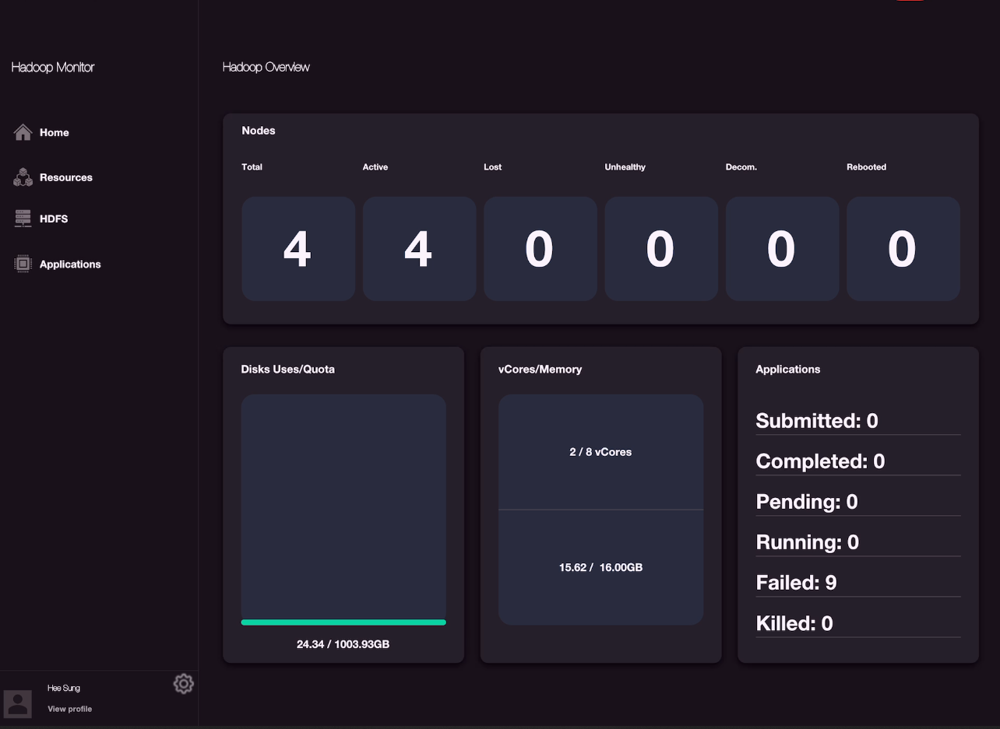
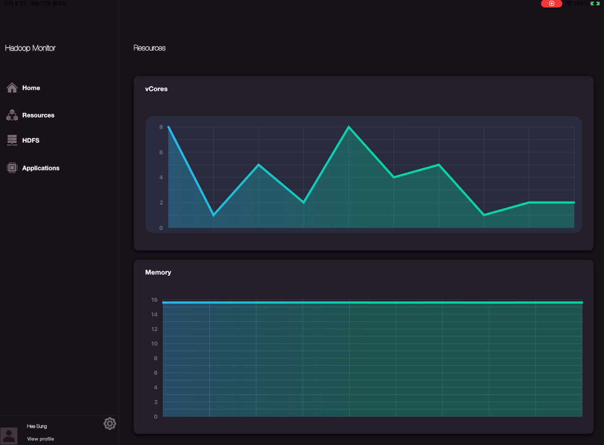
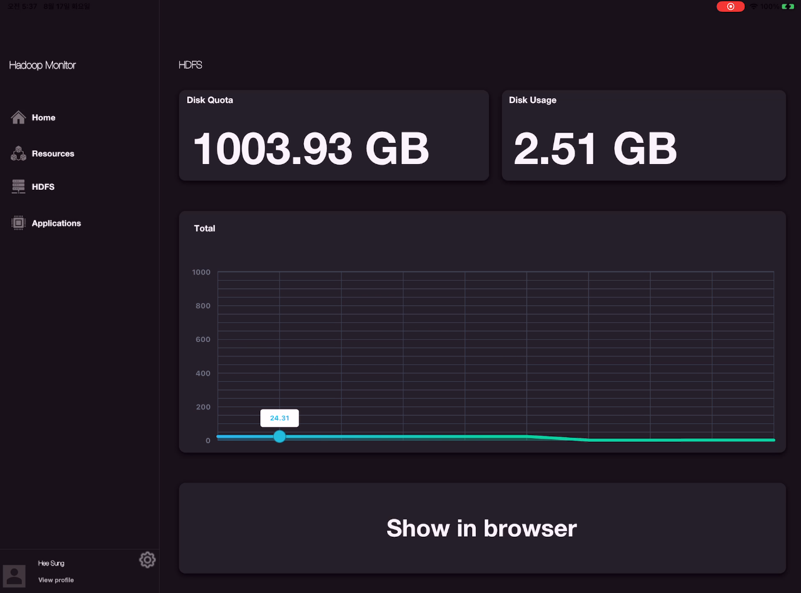
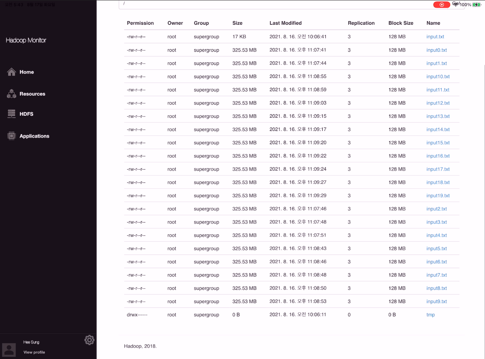
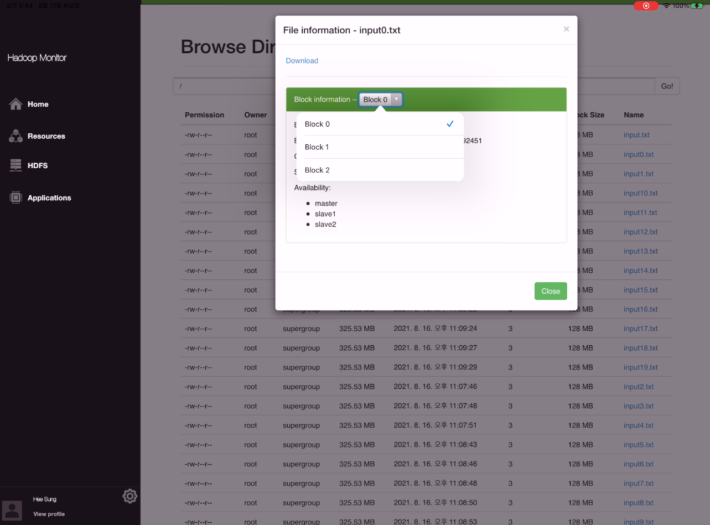
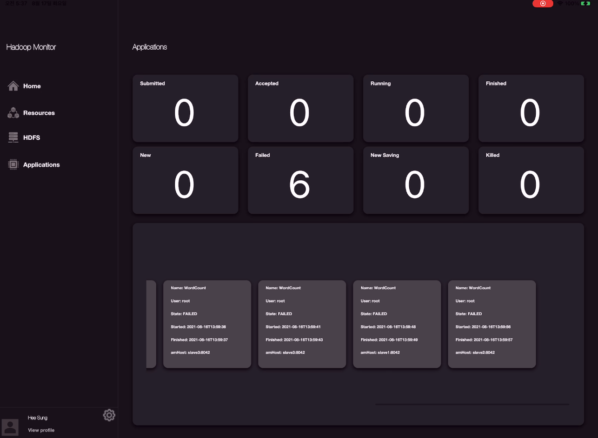

<p align="center"></img></p>

## 0. Project Name
> Container based hadoop distributed system log analyzer

## 1. Overview
Mammoth is a __container based hadoop distributed system log analyzer__. \
It monitors the Hadoop system as a whole and plays a role in easily delivering meaningful data to users. 

<br>

> Manage your Hadoop system with ease!

<p align="center"></img></p>

> Do not worry and use it in any OS!

<p align="center"></img></p>

<p align="center"></img></p>

> Easy installation!

Just copy & Paste!

## 2. Features

1. Hadoop Overview
    - Status monitoring of all nodes
    - Disk Usage/Quota monitoring with visualiztion
    - vCores/Memory monitoring
    - Status monitoring of all applications

2. Resources(Yarn monitoring)
    - vCores monitoring with graph visualization
    - Memory monitoring with graph visualization

3. HDFS(Hadoop File System monitoring)
    - Disk quota monitoring
    - Disk usage monitoring
    - Disk status monitoring with graph visualization
    - File browsing service
    
4. Applications(MapReduce applications monitoring)
    - Status monitoring of all applications
    - Detailed application information monitoring

## 3. Architecture

<p align="center"></img></p>


## 4. Frameworks
1. __Mammoth monitor__ 

<p align="center"></img></p>

> Python is installed on most systems these days.

The monitor gets the Hadoop log directly from where the Hadoop system is installed and sends data to the collector server. \
Since most systems these days have Python installed, we could implement a monitor program in Python easily and conveniently.

[Here is README.md of mammoth monitor!](https://github.com/ndo04343/mammoth/tree/main/monitor)

2. __Mammoth collector__ 

<p align="center"></img> </p>

> Very high performance, on par with NodeJS and Go (thanks to Starlette and Pydantic).

Collector server is responsible for processing data received from numerous monitors appropriately and passing the data to influxdb. \
Since it is a server that has to handle a lot of traffic, we configured a collector server by balancing the load in our service. \
The framework used for Collector Server is a framework called FastAPI. \
This framework has been proven to be as fast as __Node.js__  or __Go__ , and we used it because it is a Python-based framework.

[Here is README.md of mammoth collector!](https://github.com/ndo04343/mammoth/tree/main/collector)

3. __Mammoth__

<p align="center"></img> </p>

> Flutter is Google's UI toolkit for building beautiful, natively compiled applications for mobile, web, desktop, and embedded devices from a single codebase.

There is only one reason I used flutter in the GUI. \
Because it is a cross platform framework. \
All apps can be compiled from one source to __Windows__ , __Mac__ , __Linux__ , __iPadOS__ , and __Android tablet__. \
We do not plan to support the web environment and mobile phone environment. \
Just because I want users to use it on the __big screen__.


## 5. Installation(General user)

1. Download the __Mammoth__ and register as a member.
    - Windows, OSX, Linux, or iPad, you can use this app anywhere you can think of.
2. Install __mammoth monitor__ in your hadoop system.
    - [Mammoth monitor installation guide](https://github.com/ndo04343/mammoth/tree/main/monitor)
3. Run __Mammoth monitor__  

## 6. Installation(from server to client)

1. Download the __Mammoth__ and register as a member.
    - Windows, OSX, Linux, or iPad, you can use this app anywhere you can think of.
2. Install __mammoth monitor__ in your hadoop system.
    - [Mammoth monitor installation guide](https://github.com/ndo04343/mammoth/tree/main/monitor)
3. Install __mammoth collector__ in your own server.
4. Install __influxdb__ and __mongodb__ in your own server.
    - [Databases installation guide](https://github.com/ndo04343/mammoth/tree/main/db)

5. Change ```conf.py``` in your collector
6. Change ```conf.py``` in your monitor

## 7. Pages(Test on the iPad pro 12.9 inch 4th)

### 7.1. Initial page

<p align="center"></img></p>

### 7.2. Home page(Overview)

<p align="center"></img></p>

### 7.3. Resources monitoring page

<p align="center"></img></p>

### 7.4. HDFS page

<p align="center"></img></p>

### 7.5. HDFS file browsing page

<p align="center"></img></p>

<p align="center"></img></p>

### 7.6. Applications page

<p align="center"></img></p>

## 8. Demo video

<a href="https://www.youtube.com/watch?v=nF3AXhD264c"><p align="center"></img></p></a>


## 9. Mammoth service server status

1. Collector(Load balanced)
    - mammoth-collector1 :
        - CPU : 4 cores
        - Memory : 8GB
    - mammoth-collector2 :
        - CPU : 4 cores
        - Memory : 8GB
    - mammoth-collector3 :
        - CPU : 4 cores
        - Memory : 8GB        
    - mammoth-collector4 :
        - CPU : 4 cores
        - Memory : 8GB
    - mammoth-collector5 :
        - CPU : 4 cores
        - Memory : 8GB

2. InfluxDB
    - CPU : 8 cores
    - Memory : 64GB

2. InfluxDB
    - CPU : 4 cores
    - Memory : 32GB


<br><br><br><br><br><br><br><br><br><br><br>
### __Sponsed by__  

</img> </img> 
