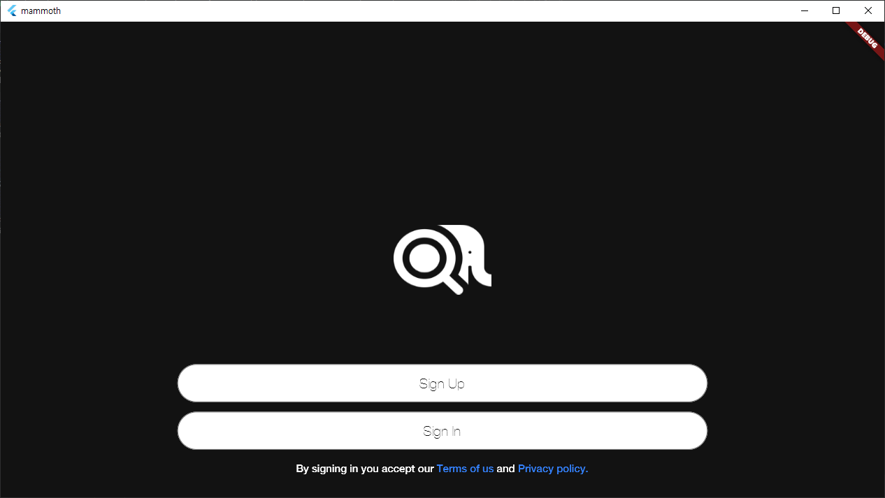
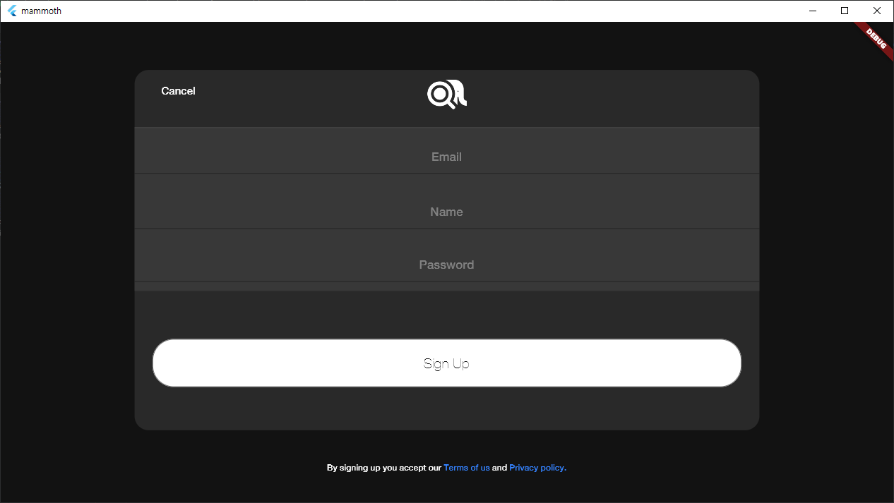
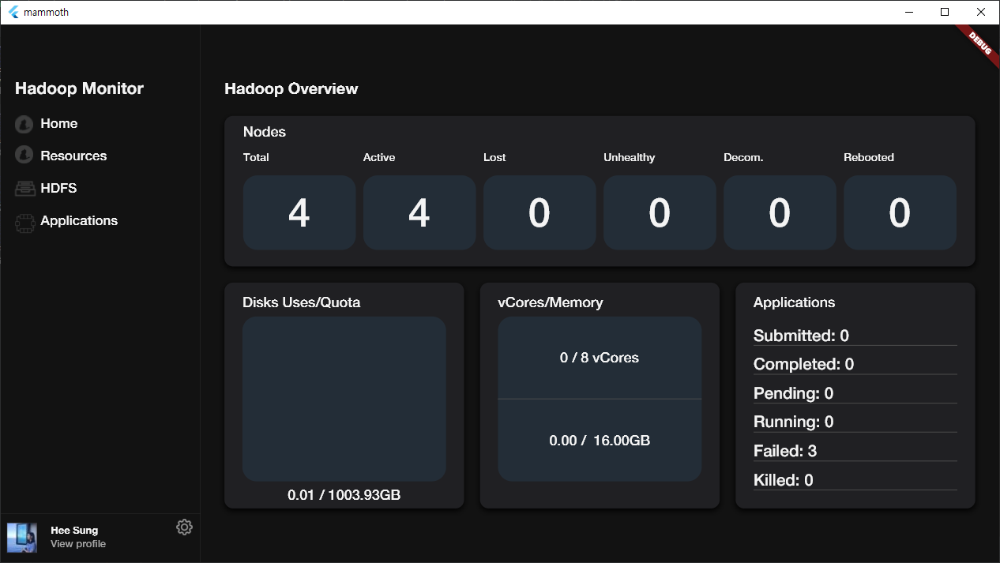
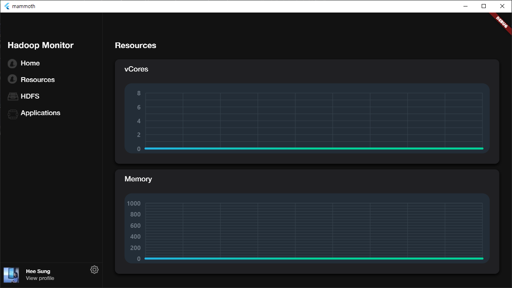
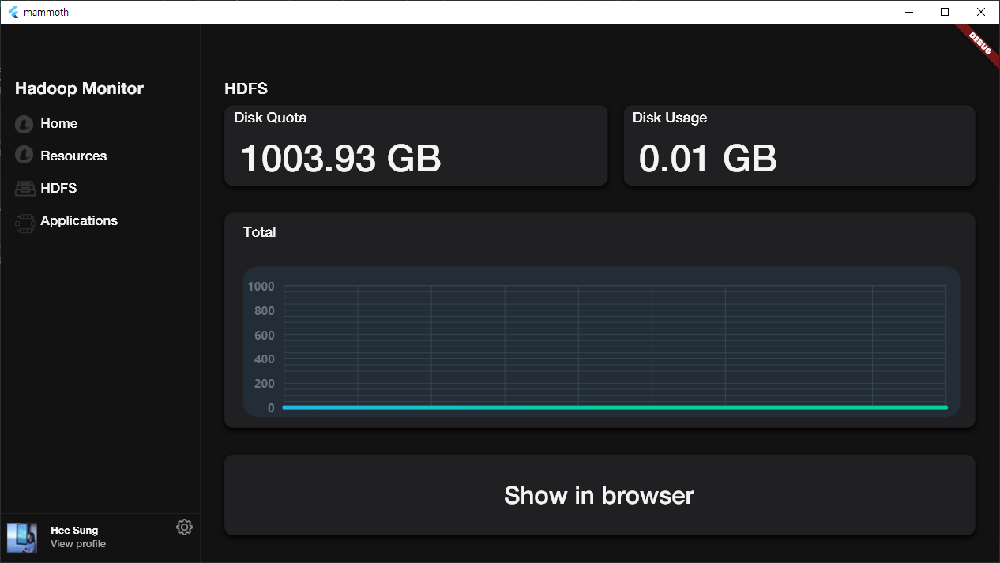
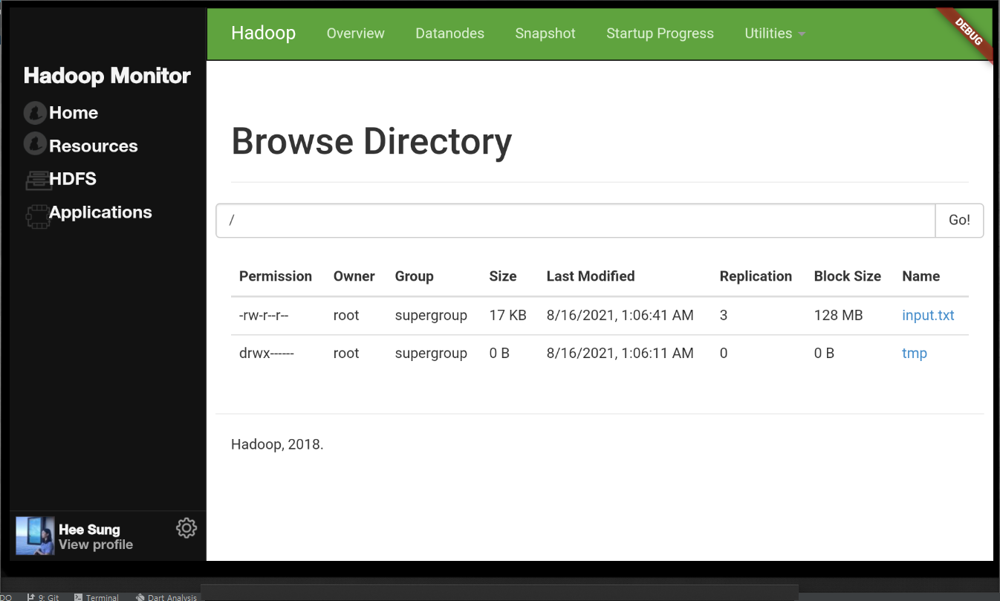
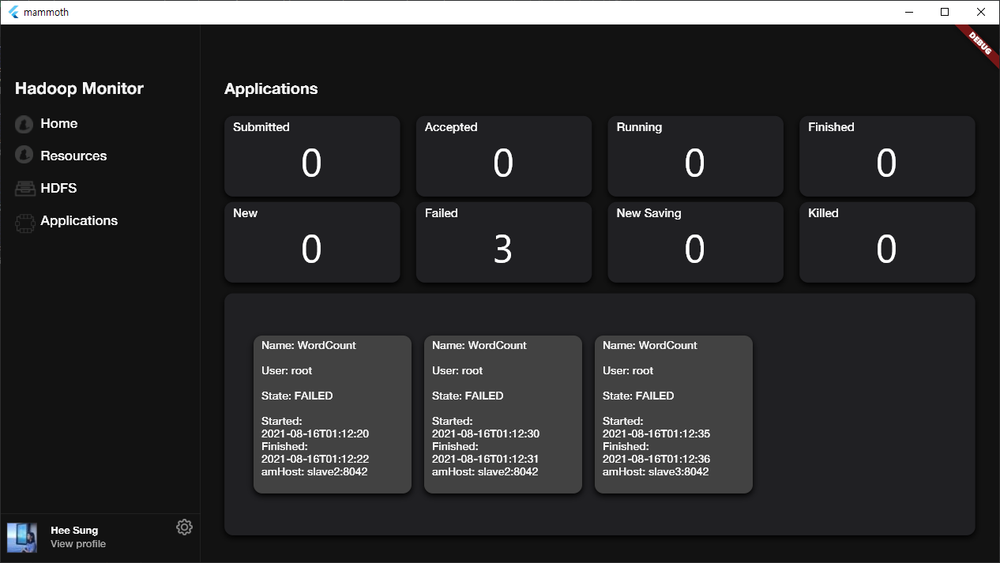

# Mammoth : xd

## 1. Overview
Adobe xd file for Mammoth app ui/ux prototyping.

## 2. Design
1. Initial page \
</img>

2. Sign in \
</img>

3. Sign up \
</img>

4. Home \
</img>

5. Resources \
</img>

6. HDFS \
</img>

7. HDFS file browser \
</img>

8. Applications \
</img>